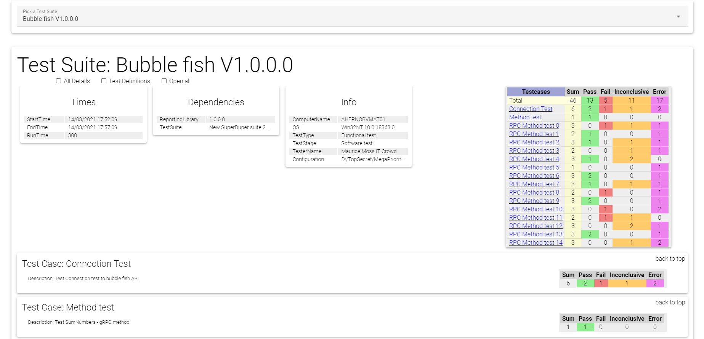

# ReportingLibrary

Goal of the code is to produce reporting library to use in software system test enviroments.

1. Small C# library with API that can generate xml report for testing
2. Transform xml report to HTML5 document with usage of provided XSLT, JS and CSS files

## XML File

Generated XML file has the following structure:

```
TestResults -> Formatversion="attribute"
    TestSuite -> Name="attribute"
        TestDefinitions -> DefinitionTitle="attribute"
            arbitrary child elements
        TestCases -> Name="attribute" Description="attribute" EAalias="attribute" TestCaseNumber="attribute"
            TestStep -> Stimulus="attribute" Timestamp="attribute"
            VerificationPoint -> Verdict="attribute" Topic="attribute" ExpectedResult="attribute" ActualResult="attribute" RawlogLink="attribute" Comment="attribute"
            RawLogWireshark(RawLog) -> Filename="" TimeStamp="" Line="" Name="" Type=""
```

## Transformation

Applying XSLT transformation to generated XML file will create HTML5 document which can be used for reporting.
Check Example folder to check how result will look like

## Example Usage

1. Clone repository
2. Build ReportingLibrary.sln
3. Check UsageExample\bin\Debug\net5.0\index.html for example results

## How to use in your procjet

1. Build ReportingLibrary.sln
2. Integrate Reporting.dll, reporting.css, reporting.js, reporting.xslt to your project
3. Check example for the API usage

## Example picture

Following image is showing how will report look after applying the correct transoframtion:

